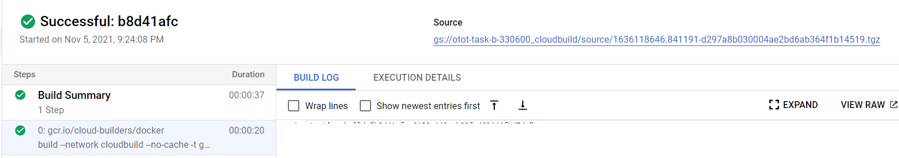
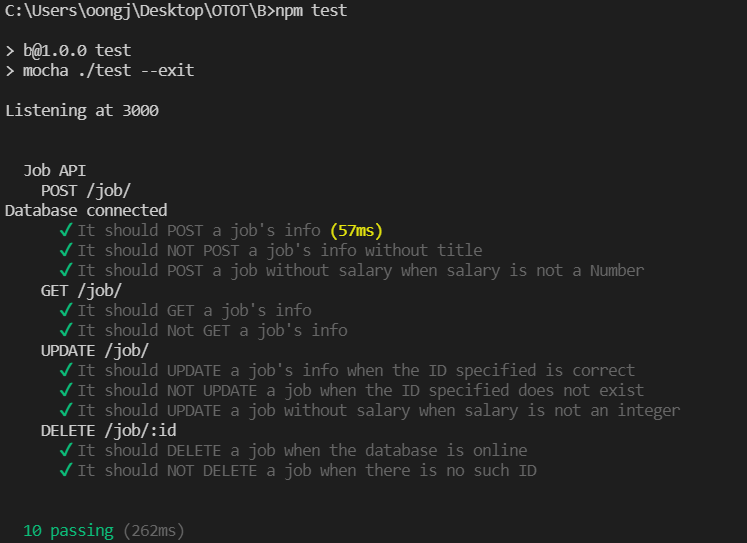

### CS3219 OTOT Assignment
### Task B: CRUD Application Task
## (a) Student Name and Matriculation Number
Oong Jie Xiang (A0242581H)

## (b) Link to the GitHub repository
https://github.com/oongjiexiang/CS3219-OTOT-Tasks

## (c) Instructions on how to
### Run the API locally, including Postman calls used to demonstrate a working API
After cloning by using `git clone https://github.com/oongjiexiang/CS3219-OTOT-Tasks.git`, proceed with the tasks below.
1. At the root folder, run `npm install` in the terminal to install the node modules
2. `npm start` to start the server (Backend server as this task is for B1). The server listens at port 3000
3. In Postman, the configurations are as follows:
#### GET
Successful GET all jobs

Successfully GET one job

Fail to GET a job as there is no such job ID

#### POST
Successfully POST a job

Fail to POST a job as `title` is not provided

Fail to POST a job as `salary` is not an integer

#### PUT
Successfully UPDATE a job

Fail to UPDATE a job as there is no such job ID

#### DELETE
Successfully DELETE a job

Fail to DELETE a job as there is no such job ID

-----
1. To try out the deployed endpoints, simply replace http://localhost:3000 with https://cs3219-otot-b1.herokuapp.com/ or https://cs3219-otot-b3-ojx-mv57od22ua-uc.a.run.app/  
2. **Assumption made**: Valid JSON string is always passed

### Access the deployed API (B1/B3)
1. When attempting B1 initially, backend was deployed on [Heroku](https://cs3219-otot-b1.herokuapp.com/) as well
2. [Cloud Run](https://cs3219-otot-b3-ojx-mv57od22ua-uc.a.run.app/) is then the serverless service (for B3) used to deploy the backend
    - To have Continuous Deployment, I wrote a Dockerfile (found in root folder) and added additional workflow actions in `.github/workflows/node.js.yml`. The code for B3 is shown in the screenshot below. Essentially, it checks out the branch, builds and image, and then deploy this image. `gcloud` image is used to execute these actions.
    - Note: The code is referred from [Towards Data Science article](https://towardsdatascience.com/deploy-to-google-cloud-run-using-github-actions-590ecf957af0)

- If the build is successful, a green tick will be shown beside the trigger name

- The following screenshot shows the build logs

### Run tests locally and via GitHub (B2)
To test locally, run `npm test` in the terminal
   
  

To test on GitHub, I wrote `.github/workflows/node.js.yml` to trigger testing on every push or pull request from `main` branch, where GitHub will run `npm test` itself. The code for B2 is shown in the screenshot below. Essentially, for every combination of (node version, mongoDB version) combination specified, GitHub Action will 
> 1. Check out the branch
> 2. Set up Node.js environment
> 3. Set up MongoDB environment
> 4. Run the build
> 5. Run tests (`npm test`)

- The two screenshots below illustrate how GitHub Action (CI tool used in this task) reports the test results

- Detailed build logs when clicking into one triggered action

### Set up frontend (B4)
1. `cd frontend`
2. `npm start` to begin the frontend server. Note that all frontend communicates with the deployed backend by Cloud Run
3. Bootstrap is used (`index.html`) to quick-start styling

When the server starts, it will direct the browser to the home page. GET request is launched

Clicking on a job card leads to the Job Detail Page. This launches a request to GET only one job. Click on the 'Delete' button to launch a DELETE request

From the Home Page, click on 'Update' button to proceed to Update Page. In the Job Update Page as shown in the screenshot below, click 'Update' to update the job details.

To create a job, click 'Create Job' at the navigation bar atop the website, fill up the form and click 'Submit' to launch a POST request

