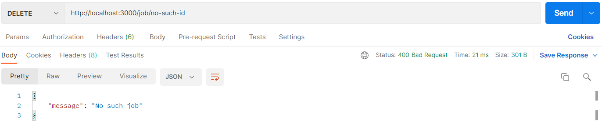
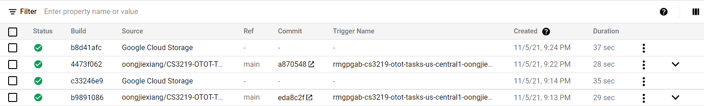
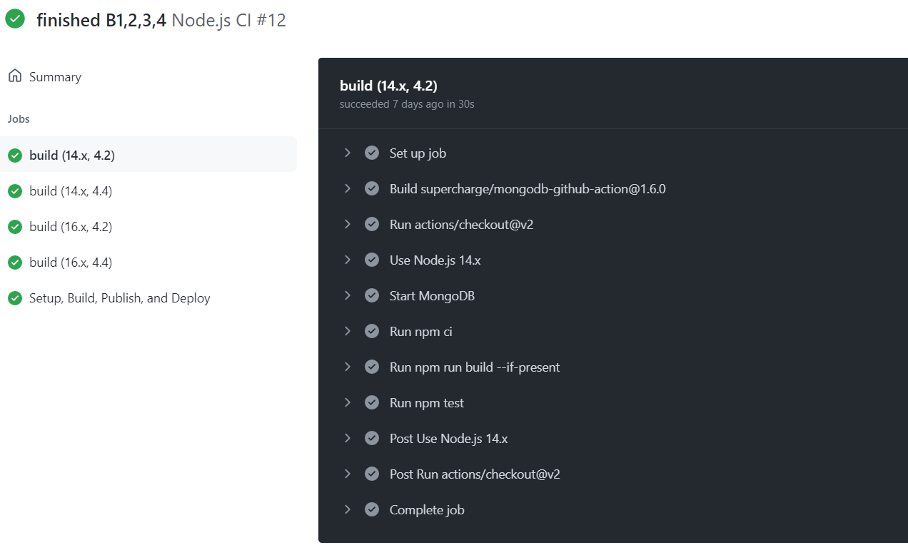

### CS3219 OTOT Assignment
### Task B: CRUD Application Task
## (a) Student Name and Matriculation Number
Oong Jie Xiang (A0242581H)

## (b) Link to the GitHub repository
https://github.com/oongjiexiang/CS3219-OTOT-Tasks

## (c) Instructions on how to
### Run the API locally, including Postman calls used to demonstrate a working API
After cloning by using `git clone https://github.com/oongjiexiang/CS3219-OTOT-Tasks.git`, proceed with the tasks below.
1. At the root folder, run `npm install` in the terminal to install the node modules
2. `npm start` to start the server (Backend server as this task is for B1). The server listens at port 3000
3. In Postman, the configurations are as follows:
#### GET
Successful GET all jobs

Successfully GET one job

Fail to GET a job as `title` is not specified

#### POST
Successfully POST a job

Fail to POST a job as `salary` is not an integer

#### PUT
Successfully UPDATE a job

Fail to UPDATE a job as there is no such job ID

#### DELETE
Successfully DELETE a job

Fail to DELETE a job as there is no such job ID

-----
To try out the deployed endpoints, simply replace http://localhost with https://cs3219-otot-b1.herokuapp.com/ or https://cs3219-otot-b3-ojx-mv57od22ua-uc.a.run.app/  

### Access the deployed API (B1/B3)
1. When attempting B1 initially, backend was deployed on [Heroku](https://cs3219-otot-b1.herokuapp.com/) as well
2. [Cloud Run](https://cs3219-otot-b3-ojx-mv57od22ua-uc.a.run.app/) is then the serverless service (for B3) used to deploy the backend
    - To have Continuous Deployment, I wrote a Dockerfile (found in root folder) and added additional workflow actions in `.github/workflows/node.js.yml`. The code for B3 is shown in the screenshot below

- If the build is successful, a green tick will be shown beside the trigger name

- The following screenshot shows the build logs

### Run tests locally and via GitHub (B2)
1. To test locally, run `npm test` in the terminal
   

1. To test on GitHub, I wrote `.github/workflows/node.js.yml` to trigger testing on every push or pull request from `main` branch, where GitHub will run `npm test` itself. The code for B2 is shown in the screenshot below

- The two screenshots below illustrate how GitHub Action (CI tool used in this task) reports the test results

- Detailed build logs when clicking into one triggered action

### Set up frontend (B4)
1. `cd frontend`
2. `npm start` to begin the frontend server. Note that all frontend communicates with the deployed backend by Cloud Run
